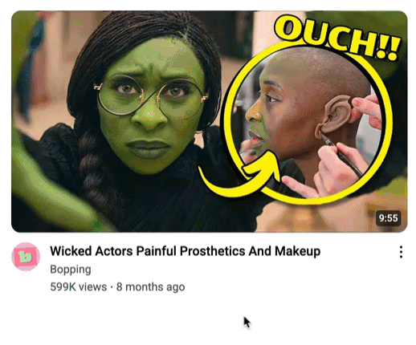

# Images in `<video>`

Authors: Lea Verou, Florian Rivoal

<details open>
<summary>Contents</summary>

1. [User Needs \& Use cases](#user-needs--use-cases)
   1. [Architectural considerations](#architectural-considerations)
2. [User research](#user-research)
   1. [Current workarounds](#current-workarounds)
   2. [Developer signals](#developer-signals)
3. [Goals](#goals)
   1. [Non-goals](#non-goals)
4. [Proposed solution](#proposed-solution)
   1. [Emulating current `` behavior with `<video>`](#emulating-current-img-behavior-with-video)
   2. [Is it web compatible?](#is-it-web-compatible)
   3. [How to treat static images?](#how-to-treat-static-images)
   4. [Would this encourage higher usage of inefficient video formats?](#would-this-encourage-higher-usage-of-inefficient-video-formats)
   5. [What about synchronization?](#what-about-synchronization)
   6. [What types of images would be supported?](#what-types-of-images-would-be-supported)
5. [Sample code snippets](#sample-code-snippets)
6. [Potential Future Improvements](#potential-future-improvements)
   1. [Sensible defaults for certain attributes](#sensible-defaults-for-certain-attributes)
   2. [Playback UI](#playback-ui)
   3. [Interest invokers to control playback](#interest-invokers-to-control-playback)
   4. [Disabling autoplay when `(prefers-reduced-motion)` is on](#disabling-autoplay-when-prefers-reduced-motion-is-on)
7. [Alternatives considered](#alternatives-considered)
   1. [Making `` and/or `<picture>` media elements](#making-img-andor-picture-media-elements)
   2. [Disabling image animation in CSS images](#disabling-image-animation-in-css-images)
   3. [Using Media Fragments](#using-media-fragments)
</details>

## User Needs & Use cases

In websites with user-generated content that support image embeds, such as social media, users often embed animated images, such as animated GIFs or APNG. By default, UAs autoplay and loop these images, which can be jarring for users, especially in use cases where there are multiple images on a single page (e.g. image galleries) and violates WCAG. Websites need to expose ways for users to control playback, especially around turning off autoplay and/or looping.

Some examples:

* Email client that wants to restrict animation for animated images sent in emails
* Image gallery, where rather than all images animating together, users hover or focus an image to trigger autoplay
* Animated emojis sent in social media

There is such a wide range of use cases and desired UIs and user experiences, that making this an automatic UA feature would not be sufficient (and is likely not web-compatible).

For example:
* **Play trigger:** Interest (Hover, focus), clicking on play button, viewport intersection, etc.
* **Playback UI:** None, play button but no pause button, play/pause button (often not looking like a standard play/pause button, see below), etc.
* **Initial state:** autoplay, autoplay only if `(prefers-reduced-motion)` is off, paused
* **Loop behavior:** loop, loop only if `(prefers-reduced-motion)` is off
* **Behavior when not playing:** Pause common when playback UI is present or the trigger is viewport intersection, rewind more common for interest triggers

Playback UI is not even always a play/pause button, e.g. this was modeled after an old Twitter (?) UI:


Additionally, there are many cases where websites need to handle videos and images similarly and it's a QoL improvement to be able to just use the same element for both, rather than having to branch. For example, a demo gallery that uses videos when available and falls back to static screenshots when not.

### Architectural considerations

There is already a trajectory of blurring hard distinctions between different media types:
- Formats like animated AVIF are just repackagings of a video format, blurring the lines between "image" formats and "video" formats.
- UAs already support videos in `<audio>` elements and audio files in `<video>` elements. ([testcase by Jake Archibald](https://random-stuff.jakearchibald.com/media-combinations/))
- WebKit has already shipped support for videos in `` elements (see [whatwg/html#7141](https://github.com/whatwg/html/issues/7141))

## User research

### Current workarounds

The cornucopia of existing workarounds demonstrates demand for this feature. The significant downsides of these workarounds demonstrate why this needs to be solved in the platform.

The prominent current approaches can be summarized as:

1. Scripts or components that render image on canvas to get freeze frames, then use custom UI to toggle between them
  * Examples: [`<wa-animated-image>`](https://webawesome.com/docs/components/animated-image) (and older [`<sl-animated-image>`](https://shoelace.style/components/animated-image)), [`<gif-player>`](https://captaincodeman.github.io/gif-player/components/gif-player/demo/), [`react-gif-player`](https://github.com/benwiley4000/react-gif-player#readme), [`Giffer`](https://krasimir.github.io/gifffer/), [Freezeframe](https://ctrl-freaks.github.io/freezeframe.js/), [`buzzfeed/libgif-js`](https://github.com/buzzfeed/libgif-js)
2. Server-side frame extraction, custom UI with JS to toggle between them
3. Server-side conversion to video, then just use `<video>`. Many large-scale gif galleries do this but such a computationally expensive solution is not always within reach for smaller publishers.

**Server side solutions** are computationally expensive (and thus, costly), and not always an option due to video encoding patents. Additionally converting to video is a poor solution when an alpha channel is desired, as video formats with alpha channels have less broad device/app support.

**Client-side solutions** are subject to same-origin restrictions, so they are a poor solution for user generated content, and also break progressive rendering. Since they depend on simply swapping static frames with the actual animated image, they have no control over looping or other aspects of playback — such control demands even more heavyweight solutions such as reimplementing image decoding on the client.

### Developer signals

While by no means unbiased or scientific, a quick social media poll shows large developer demand for this:

* [X poll](https://x.com/LeaVerou/status/1951457982916469028)
* [Mastodon poll](https://front-end.social/@leaverou/114956605810091186)
* [Bsky discussion](https://bsky.app/profile/lea.verou.me/post/3lvezoaigws2c)

There are also several questions around accomplishing this on Q&A sites:
- https://stackoverflow.com/questions/21872700/how-can-i-play-a-gif-like-9-gag
- https://stackoverflow.com/questions/29661821/is-it-possible-to-pause-a-gif-image
- https://stackoverflow.com/questions/5818003/stop-a-gif-animation-onload-on-mouseover-start-the-activation
- https://reddit.com/r/HTML/comments/3hjccx/how_can_i_animate_and_stop_gifs_with_mouse_hover/
- https://www.reddit.com/r/FirefoxCSS/comments/1523xwr/stop_animated_gifs_play_on_hoverclick/

## Goals

* Provide website authors playback control over animated images, allowing them (at a minimum) to control playback and looping
* Authors should not need to create their own playback UI to provide this functionality to their users
* Authors should have full styling control over playback UI, either by customizing UA-generated UI, or recreating it, and ideally both.
* Provide a way for authors to embed visual media without having to detect format and branch

### Non-goals

* Controlling animation of CSS images
* Retrofitting all images on a page to not animate, without making HTML changes

These are valuable (and may target them separately), but out of scope for this proposal.

## Proposed solution

The proposed solution is to support images (animated or not) in `<video>` elements.

Video elements already have all the desired functionality, so this adds no new API surface. They support a rich API for controlling playback, UA-generated controls, and make it possible for authors to build their own controls. Proposals like [Pseudo elements for `<video>` content and controls](https://github.com/whatwg/html/issues/10507) will make it possible for authors to customize existing controls, without having to rebuild them, and proposals like [predefined play/pause invoker commands]() will make it easier to build custom playback UIs.

Architecturally, this seems appropriate, since animated images are essentially videos with no audio track. Their implementation details are different, but there is no difference in terms of user-facing result.

### Emulating current `` behavior with `<video>`

To emulate the behavior of standard `` elements, authors would need to specify quite a few attributes: `<video muted autoplay loop playsinline>` . However, given that the core use case is disabling autoplay and/or looping, in practice not all need to be specified.

Another issue is that there are a few `` features that are not yet supported in  `<video>`:

* No `loading=lazy` though there is a [proposal](https://github.com/whatwg/html/issues/10376) to add it which appears to have consensus
* No `fetchpriority` . `fetchpriority=high` is rarely desirable here, and `loading=lazy` can cover many of the use cases for `fetchpriority=low` .
* No `referrerpolicy` though there is a [proposal](https://github.com/whatwg/html/issues/7822) to add it

### Is it web compatible?

Given that images in `<video>` are currently treated as an authoring mistake, we believe it’s unlikely that this could introduce significant web compat issues. `<video>` already has all the machinery to handle unknown formats.

### How to treat static images?

While at first it seems reasonable to restrict this functionality to animated images only, that would be worse for both authors and implementors:

* UAs would need to read a variable number of bytes to even determine whether some formats are animated (for example, in APNG reading the [acTL](https://www.w3.org/TR/png-3/#5ChunkOrdering) chunk [comes after variable length descriptive metadata](https://www.w3.org/TR/png-3/#5ChunkOrdering))
* Authors would need to detect whether an image is animated and use different elements, which is nontrivial in most templating environments. By allowing static images as well, they can simply use `<video>` indiscriminately.

Static images could be treated as videos with one frame, and a predefined duration. Possible choices for that are:

* 0 (preferable, as it makes detection easier)
* 1 fps (for a given fps)
* NaN
* Infinity
* undefined

Ideally, controls would not be rendered for static images even when the controls attribute is present, but if that increases implementation complexity, they can be hidden in authorland.

### Would this encourage higher usage of inefficient video formats?

It is well known that gif is an inefficient animation format. APNG files are also extremely large. Would this exacerbate the problem by encouraging their use?

The vast majority of use cases are around user-generated content. Whether `<video>` supports images will not affect user behavior, as it’s an author-facing benefit. Additionally, users often upload gifs because they want the autoplay behavior. If websites were able to treat them the same as videos, users may be more encouraged to upload videos in the first place.

This feature will reduce server-side conversion to videos, but we think that the benefits of this not being required outweigh the disadvantages.

### What about synchronization?

Animated images used in CSS or `` are currently synchronized. Animated images used in `<video>` would need to be treated as separate instances, as synchronization is directly at odds with playback control. However, the benefit of synchronization only matters on pages where there are multiple instances of the same animated image, which is not where animated images in `<video>` would typically be used.

### What types of images would be supported?

Most user needs are around raster images, such as `image/gif`, `image/apng`, and `image/webp`, and `image/avif`.
However, it may make sense to enable this for all `image/*` formats, whether they support animation or not, so that authors don't need to detect format and branch to `` for certain formats.

One challenge is around SVGs, as the way they implement animation is vastly different than _both_ video formats _and_ animated images.
If we can reliably distinguish animated vs non-animated SVGs, perhaps a way forwards could be to treat animated SVGs as videos with no specified duration, same as live streams.
If that would make implementation challenging, SVGs _could_ be defined as out of scope for now, since very few use cases where user control is desired over animation playback involve SVGs.

## Sample code snippets

> [!NOTE]
> These are optimized for readability, and thus do not cover all edge cases.

No autoplay, show UI controls for playback:

```html
<video src="foo.gif" controls loop muted></video>
```

---

Start paused and play on hover and focus:

```html
<video src="foo.gif" loop muted tabindex="0"></video>
```

```js
video.addEventListener("pointerenter", e => e.target.play());
video.addEventListener("pointerleave", e => e.target.pause());
video.addEventListener("focus", e => e.target.play());
video.addEventListener("blur", e => e.target.play());
```

This could also be easily automated via a web component.

---

Autoplay unless (prefers-reduced-motion) is on:

```html
<video class="image" src="foo.gif" controls loop muted autoplay></video>
```

```js
if (!matchMedia("(prefers-reduced-motion)").matches) {
  for (let video of document.querySelectorAll("video.image[autoplay]") {
    video.autoplay = false; // needs to run before resource loads
  }
}
```

---

Play once when in view, then provide playback UI to replay (e.g. social media animated emoji):

```html
<video src="foo.gif" loop muted class="image"></video>
```

```js
const observer = new IntersectionObserver(entries => {
for (const {target, intersectionRatio} of entries) {
  if (intersectionRatio === 1) { // Fully visible
   target.play();
   target.controls = false;
   target.addEventListener("ended", e => e.target.controls = true);
  }
  else if (intersectionRatio === 0) { // Left the viewport
    target.pause();
    target.controls = false;
  }
 }
});

for (const video of document.querySelectorAll("video.image")) {
 observer.observe(video);
}
```

## Potential Future Improvements

This is a first step in addressing the most pressing existing pain points by making complex things possible. There is a lot to be done for making simple things easy.
Some ideas for potential directions for future improvements are listed below.

### Sensible defaults for certain attributes

#### No `muted` when no audio track and/or when `autoplay` is on

Currently, `muted` needs to be specified for autoplay to work, even when the video does not even contain an audio track ([testcase](https://codepen.io/leaverou/pen/OPymaOE))

Perhaps, `autoplay` can simply set `muted` to `true` rather than making it an error condition.
Or at least not require it for videos with no audio track, which would include images.

#### No controls for static images

If possible, it would be nice to not render playback controls for static images, even if `controls` is specified.

### Playback UI

Images typically need much simpler player UI, but that is also useful for certain types of videos as well.


A new value for `controls` (e.g. `controls="simple"`) could give UAs a hint to generate simpler controls.
Alternatively, an expansion of `controlslist` could support UA-generated simpler controls, rather than requiring authors to recreate them from scratch.

Pseudo-elements for customization of video controls is already discussed in [`whatwg/html#10507`](https://github.com/whatwg/html/issues/10507)

CSS pseudo-classes could be introduced to target images separately, or target static images separately. These could be either duration based (e.g. `:min-duration() `) or for predefined things (e.g. `:static`)

### Interest invokers to control playback

While autoplaying on hover/focus is more common for animated images, it _is_ also used for videos, e.g. to show a preview in search results. YouTube is a good example:



[Interest invokers](https://open-ui.org/components/interest-invokers.explainer/) are a proposal that defines a device independent concept of "interest" that can trigger commands declaratively.
Expanding Interest invokers to include playback commands could generalize this interaction to a wider range of devices and eliminate the need for custom JS.

### Disabling autoplay when `(prefers-reduced-motion)` is on

Ideally, it should be possible to disable autoplay declaratively when `(prefers-reduced-motion)` is on, but that is orthogonal to this proposal, as it applies to regular videos too.

## Alternatives considered

### Making `` and/or `<picture>` media elements

The obvious alternative is to retrofit `` and/or `<picture>` to extend from `HTMLMediaElement` and adding appropriate attributes to them.

While this may be valuable to pursue independently at a later stage, it is a much larger scope addition.

First, there is the question of whether retrofitting `` to inherit from a different superclass is web-compatible at all. How much user JS walks up the inheritance chain for `HTMLImageElement` instances?

Second, many of `HTMLMediaElement’s` opt-in features, are on by default in `` with no way to opt-out:

|               | `` | `<video>` |
|---------------|---------|---------|
| Autoplay?     | ✅ (no opt-out) | Opt-in (`autoplay` + `muted` attributes) |
| Loop?         | ✅ (no opt-out) | Opt-in (`loop` attribute) |
| Muted?        | ✅ (no opt-out) | Opt-in (`muted` attribute). |
| Playback UI   | ❌ | Opt-in (`controls` attribute) |
| Plays inline? | Always | Opt-in for mobile (`playsinline` attribute) |
| Lazy loading  | Opt-in (`loading=lazy`) | [Proposed](https://github.com/whatwg/html/issues/10376) |
| Synchronized? | ✅ (no opt-out) | ❌ |

While having different defaults is not an issue for the JS side of things, for the HTML part of the API, it would require adding new attributes (e.g. `noautoplay` , `noloop` etc), which would in turn need to be reflected in the `HTMLMediaElement` API.

### Disabling image animation in CSS images

This does not target the use case of disabling autoplay and/or looping in CSS images which authors may want to disable globally on `(prefers-reduced-motion)`.
This has very distinct characteristics than the use cases this proposal is addressing, notably that it is typically around disabling animation, not exposing playback controls to users.
It is discussed separately in [csswg-drafts#1615](https://github.com/w3c/csswg-drafts/issues/1615) and we plan to address it separately in the CSS WG.

### Using [Media Fragments](https://www.w3.org/TR/media-frags/)

While supporting [temporal media fragments for animated images](https://github.com/w3c/media-wg/issues/54) would be independently useful, architecturally media fragments are about getting _part of a resource_, not controlling playback.
Additionally, Media Fragments are currently [outside any WG charter](https://github.com/w3c/media-wg/issues/54#issuecomment-3145757411) and have not received updates in 13 years.
